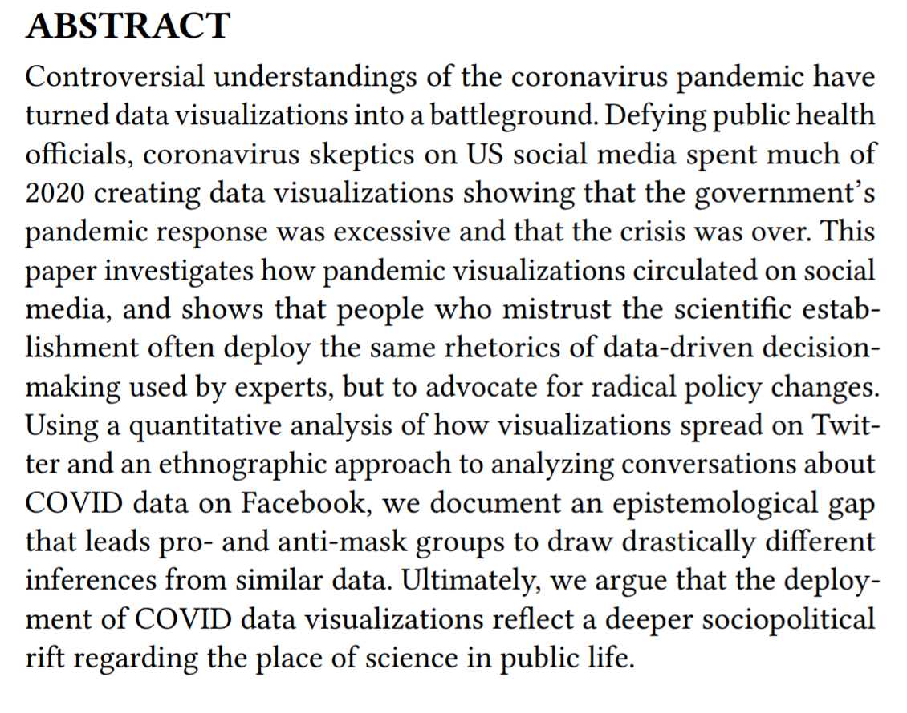

Link to this full visualization paper can be found here: https://arxiv.org/pdf/2101.07993.pdf

This paper was a very interesting read, especially since this is such a big part of the modern world.
Essentially, the researchers argue that the use of COVID data visualizations reflect a "deeper sociopolitical rift regarding the place of science in public life."

Anti-maskers and COVID-deniers ignore scientific evidence to argue for individual freedoms and make up "counter-visualizations" to make unorthodox arguments.
They also touch on how this is a political struggle, and many people argue for open access to the government data. 
The groups try to use counter-visualizations to show that the US government's response is overblown, so essentually they use the same data and draw different conclusions which are not very scientifically accurate.

The examples of anti-masker vis designs truly drew my attention, especially the "USA COVID NUMBERS chart." I understand where they are coming from, but still, the number of (more than usual) deaths in comparison to population of the country is immense, but because of the picture, it isn't as easy to fathom.
I find that they take real data and skew it to fit their agenda, their idea. It's almost a "justification" to why they don't want to keep wearing masks.

The researchers conclude that convincing these people to support public health measures requires more than good data visualizations, but engagement with the social world of vis.
It is important to not only create "better" vis, but also have people who will be able to efficiently interpret them and explain them to others.
We need to recognize systemic dynamics that contribute to the rift between people, science, and public health.

