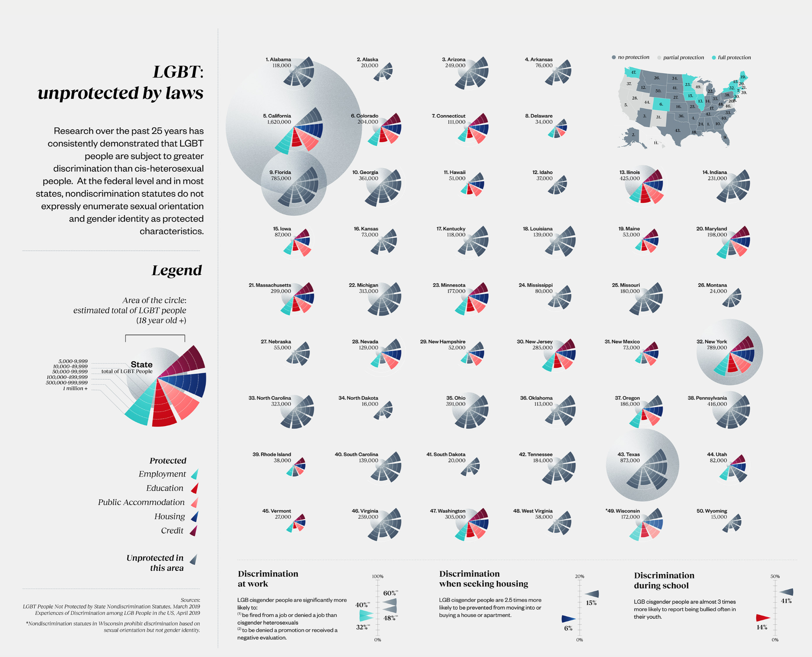

Here is the link to the full visualization!! https://www.behance.net/gallery/89678981/LGBT-unprotected-by-laws

The vis I chose was created by Gabrielle Merite and presents the research done over 25 years relating to 
discrimination of the LGBT community and where they are unprotected by the law. I really love the way this visualization
uses color. It's very clear which states protect LGBT citizens, and which do not. Since the community advocates using
rainbows and bright happy colors, the states that DO protect these people show the data in colors: cyan, red, pink, blue,
plum. Any statistic shown in grey represents people who are unprotected by laws. 

The way the population estimation is shown is very confusing at first. I don't know the technical term but it looks 
like a bar graph that also has to be a pie chart. However, the more I look the cooler it is. The larger the wedge, the 
more people who either are or are not protected. This is significant for analyzing because you can see which states have
a lot of people to protect and thus fail to. It's helpful how she includes the map of the United States because you not only
get to see each individual states' statistics, there's also geographical comparisons to draw conclusions from.

I didn't love how Texas and New York could "blow up" to a ;arger size, but none of the other states did, however I'm sure
it was done for the purpose of comparing states with similar estimated populations of LGBT and opposite protective laws.
I'm glad there's a legend to organize all of the information and show what to look for, but I still found it difficult
to figure out what I was seeing.

