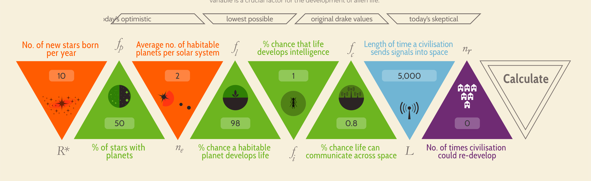
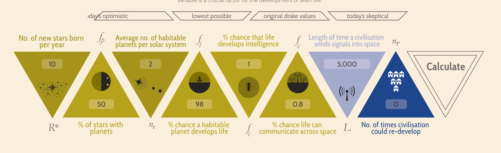

Here's the link to my week 5 visualization! https://informationisbeautiful.net/visualizations/the-drake-equation/

This was a very interesting find for multiple reasons. I want to begin by commenting on the color scheme. 
While the bright colors catch my eye, I was curious to see how it would appear to somebody with red/green color-blindness, so I ran it through a simulation!

Normal Vision:

Deuteranopia:

Protanopia:

As a normal-visioned veiwer I can quickly recognize the color choices, green/orange/blue/purple buttons depending on the constants in the equation. 
Somebody with color-blindness would not be able to appreciate all of the detail that went into this vis, something the artist can take into consideration for next time.
What I found particularly interesting was how the interaction of this vis works.
This visualization is a bit different than ones we frequently see. 
It is an interaction that uses stronomer Frank Drake's equation and lets users input their own estimations, while including pre-set data values for certain scenarios.
When you hover over a variable the +/- feature appears, allowing you to interact with the vis through the buttons or by editing the text box. It also requires the user to click calculate in order to actually present the estimated value.

I really love the way this vis uses small images to make things these "variables" more interesting and easier for the typical person to understand what it means and why it's important.
The vis does a very good job of making something that is very complicated to understand, into something fun to play around with and learn about!

An extra note I would like to mention is the usability of the mobile version of this vis. 
The number boxes were very difficult to read and edit and I'm sure if I saw the mobile vis first I would not have been as impressed.
The +/- feature of the design is very useful when you want to test your own theory, but on mobile there is no indication of whether or not this feature is working/worked unless your screen is at the perfect angle to read black text on a black background.
Overall, this is a beautiful vis that is slightly less beautiful if you see it on your phone screen, oh well.

