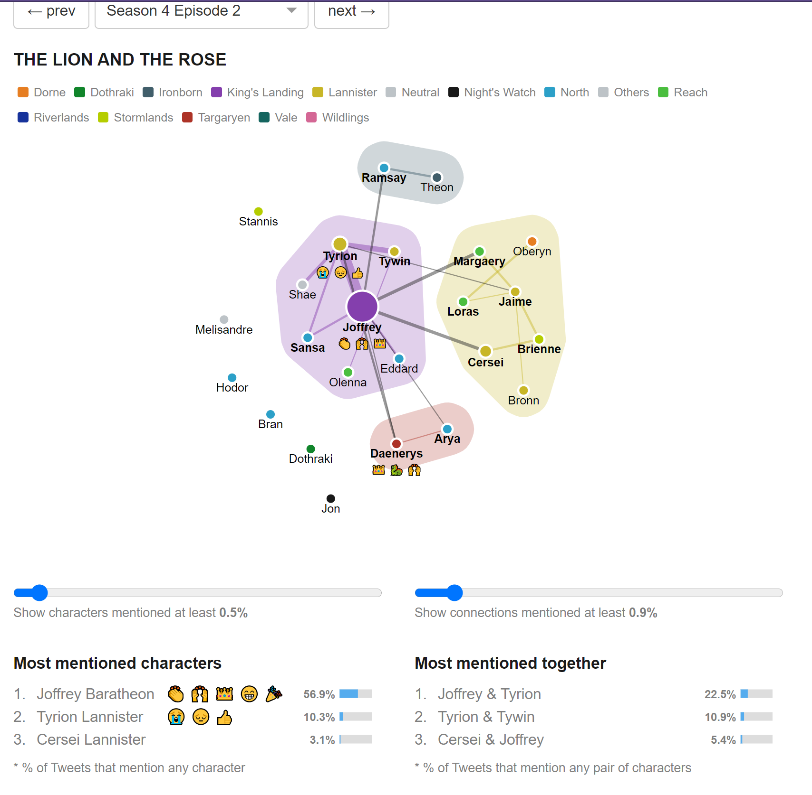

For my final reflection on a data visualization (until we begin visualization techniques) I have chosen an interesting interactive vis based on Twitter data.
You can view it here! https://interactive.twitter.com/game-of-thrones/#?episode=32 

Rather than a focus on locational data, this visualization interestingly analyzes and represents thematic interest of fans after a show premieres.
The visualization is complicated. You must choose a specific episode to be represented, and from that point you are allowed to play with how much information is actually showing.
The circles represent each character, and the size of their bubble is mapped to how often they are mentioned on twitter. 
An interesting addition to this vis is the use of emojis. This is an unusual visualization tactic, but since we are exploring data from twitter, I found this to be a genius idea.
I also noticed the use of lines, where the line represents two characters that were talked about together, and the thickness indicated how often this occurred.

Something that was slightly confusing was the color clusters. While I appreciate knowing that they represented storyline plot, but there was no obvious way to make sense of it if you haven't seen the show.
I am familiar with the show, but not a loyal viewer, so the color mapping of the dots and of the clusters could have been a bit clearer.
There is a lot of ways to explore this vis, but I'm not sure I appreciate the "click and drag" because it just makes the visualization get jumbled and unclear.
My favorite aspect to this design is the hover feature that can focus on a singular character alone. 
This is helpful because maybe somebody is only interested in finding out the details of a specific character or a specific relationship.
Overall, this was a really cool visualization and showed some interesting data!

