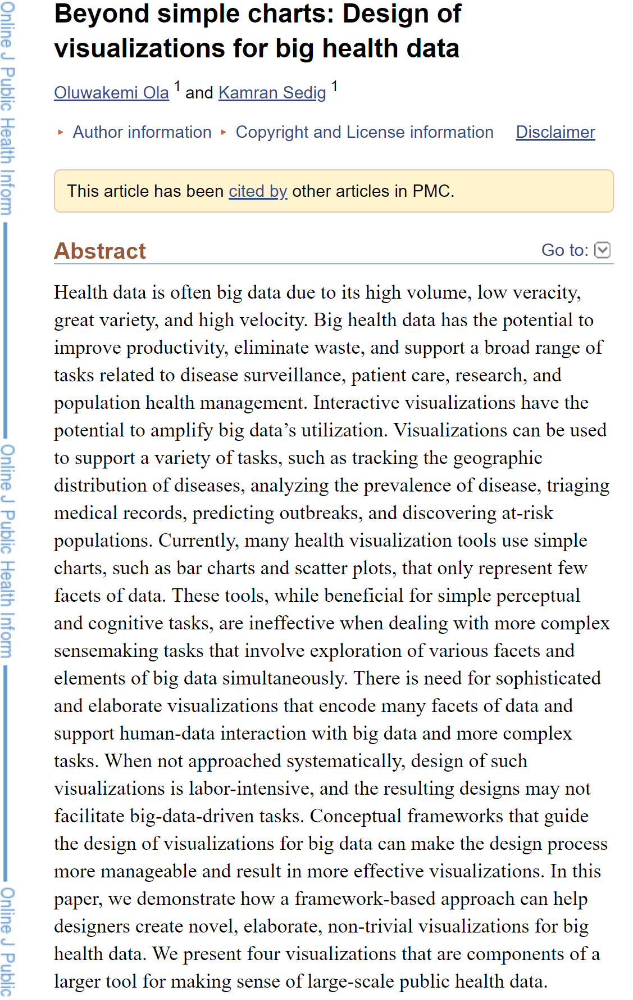

Week 7
---

The link to my vis-related research paper is here:
https://www.ncbi.nlm.nih.gov/pmc/articles/PMC5302463/

## Summary of Research
The visualization research paper I found for this week's reflection is "Beyond simple charts: Design
of visualizations for big health data." 
This research explains how integrating complex health data with interactive visualizations can improve 
productivity, patient care, research, and health management.
Because vis can be used to support so many tasks relating to public health, it could be so much more 
efficient if the vis tools use more than just simple charts.
This paper goes on to demonstrate how a framework-based approach helps designers create more elaborate
and effective visualizations for big health data.

## Systematic Design of Visualizations for Big Public Health Data: Geography
I'm choosing to write about the geography visualization because I found it to be the most interesting 
visualization of the four.
In the explanation, everything is laid out, expressing a clear framework for every aspect of the data.
The ultimate goal is to show data that facilitates the exploration of mortality over geography.
While this seems like something that wouldn't be too intense to track, the authors make it clear
that using an incredibly complex visualization for this purpose is exponentially more effective, clear,
and accessible. 
Users can learn about causes and risks of death globally using the various sub-visualizations that
contribute to a successful vis.
I found it most intriguing how in every vis this group created, geographical entities contribute to the 
design, but the main focus of this vis (geography) is actually tracing mortality through the spatial 
attributes of geography data.
However this vis doesn't stop there, you can even use this hierarchy of a design to explore the 
relationship of cause/risk within one geographic cluster. 
Overall, this specific vis, and the research/framework behind it, made it very clear just how impressive
interactive visualizations can be, and also how beneficial it is to represent complex data.
Using - Branch - Token - Coordinate - List - Group - Spectrum - Area - Cell - patterns in each and every
sub-visualization, everything seems to come together so smoothly.

Below I am including a screenshot of the abstract to the really awesome paper!

