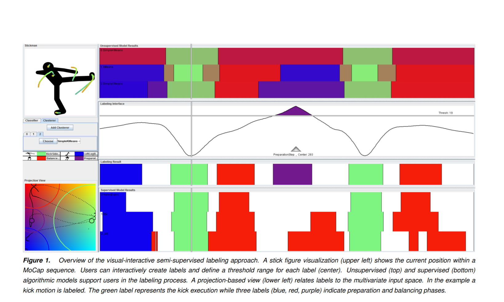
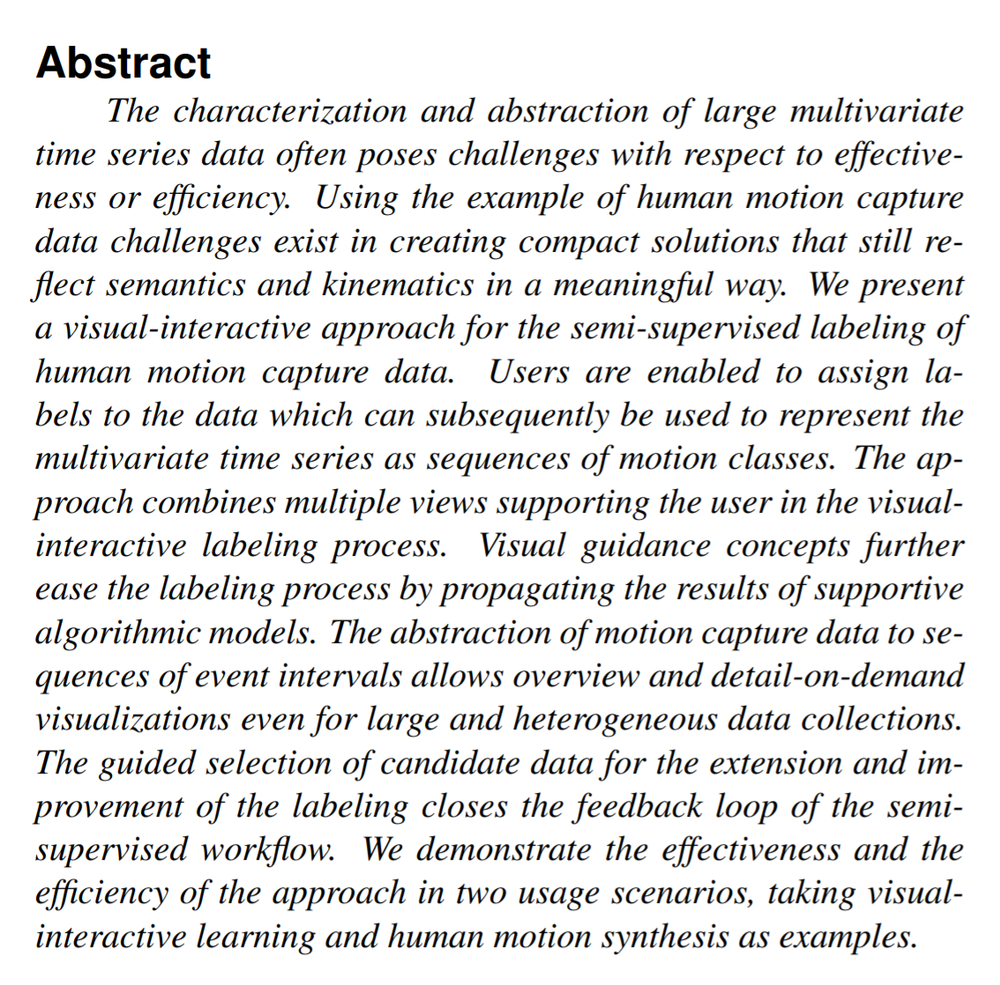

Week 9
---

For this week's discussion, I found a research paper that explores the visualization of human motion.
The article can be found here: https://doi.org/10.2352/ISSN.2470-1173.2017.1.VDA-387

This article really caught my attention, especially since I don't think we've ever really talked about
vis and motion in this way.
I was especially curious to learn about it because I'd only really thought about motion/animation in visualizations,
but nothing about data that represents motion.
They approach this challenge using multiple views to support visual-interactive labeling, and found
that visual guidance makes the labeling process easier.
In order to actual show this motion-capture data, they have to break it up into a sequence of events
in intervals which allows for detail and ease for modeling.
In the Conceptual Workflow section, they explain a technical approach that actually enables users to
label (define key pose) data in a semi-supervised way. Since the motivation for their approach is to
help user groups assign meaningful labels to MoCap data, this was especially interesting. How can they be 
SEMI-supervised?
They describe a feedback loop of workflow, where different mechanisms support a user in selecting alternate
labels or just a singular sequence.
Another thing I really appreciated about this research is the intersection of humans and computers. It's
all about how algorithmic models and machine learning support human productivity with visualization.
The most critical components to this paper was the two-step workflow they presented and the two scenarios
that demonstrated the effectiveness of their active learning approach. They start small, allowing users to 
to identify key poses, and then they explore a larger search space.
The conclusion of the first scenario is interesting in the fact that with a small number of labels, 
there can still be very high coverage on the entire data set.
The second scenario addresses the actual goal of synthesizing motion capture data and concludes that
based on previous labeling of even a small sequence can be significant in larger data collections.
Overall I really liked reading about this cross between human users and computer algorithms analyzing human motion data.

